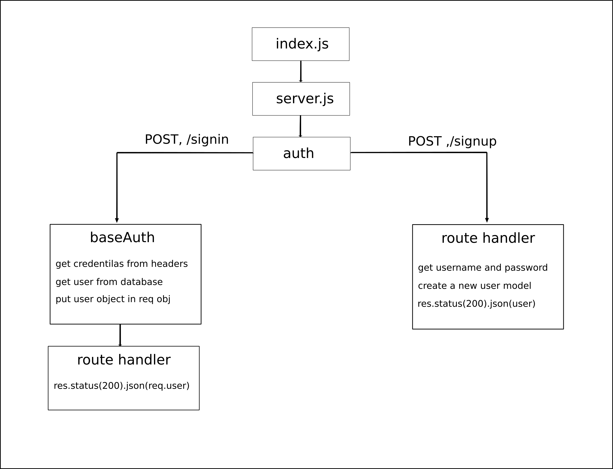

# basic-auth

## Author: Wesam Al-Masri

A simple API server with authentication system to register a user and login.

- [Submission Pull Request](https://github.com/401-js-WesamAlmasri/basic-auth/pull/1)
- [Tests](https://github.com/401-js-WesamAlmasri/basic-auth/actions/)
- [Deployed url](https://auth0-api-app.herokuapp.com/)

## Setup

`.env Requierments`

- `PORT` - port number
- `MONGODB_URI` - mongodb connection string

## Running the app

1. clone the repo.
2. Enter the command `npm start`
3. Endpoints
   1. Auth endpoint`/signup`
       - method : POST
          - create a new user
       - response: JSON

         ```json
          {
            "_id": "60a90a0622695b58a6051c0f",
            "username": "weseem",
            "password": "$2b$05$nGJ85o1gmcwUFKGrx5bA.OQ6phkMVtsi0fAcjNQlNrj2teO..ZyT2",
            "__v": 0
            }

         ```

   2. Auth endpoint`/signin`
       - method : POST
          - login in with certian user
       - Respons: JSON

         ```json
          {
            "user": {
                "_id": "60a90a0622695b58a6051c0f",
                "username": "weseem",
                "password": "$2b$05$nGJ85o1gmcwUFKGrx5bA.OQ6phkMVtsi0fAcjNQlNrj2teO..ZyT2",
                "__v": 0
                }
            }
         ```

4. Test
   - Unit Tests: run the command `npm run test`

## UML


